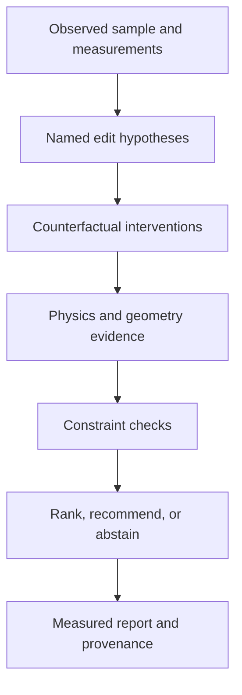

# Architecture

FitGround is a physics-grounded next-edit decision engine for garment pattern correction.

## Decision contract

- Inputs bind observations to a supported garment, body, material, and pose regime.
- Candidate actions modify named pattern parameters in explicit units.
- Interventions produce measurable geometric or physical consequences.
- Constraints check secondary damage and support-set validity.
- Insufficient evidence results in abstention rather than a fabricated correction.

## Evidence boundary

Rendered examples are physical simulation evidence inside the documented setup, not commercial virtual-try-on claims or real-garment deployment proof.
