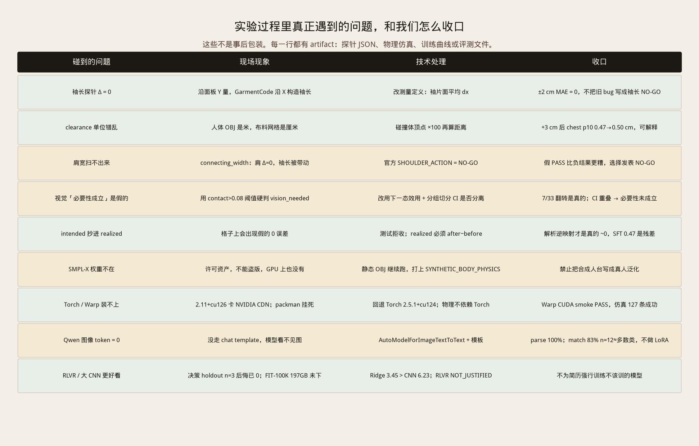

> **Portfolio status / 作品集状态：FLAGSHIP · Physical AI**
> Canonical independent flagship repository for physics-grounded decision systems.

<p align="right">
  <b>中文</b> · <a href="./README_EN.md">English</a>
</p>

# FitGround

**样衣不对。下一版改哪个纸样参数、改几厘米、别的地方会不会坏？**

FitGround 不是试衣间，也不是聊天机器人。它是给 **技术设计师** 用的下一版修正引擎：证据不够时拒答，而不是编一个厘米数。

[](https://github.com/Benjamindaoson/FitGround)
[](https://huggingface.co/datasets/jlai300/FitGround)

| 当前样衣（静态人台垂坠） | 把胸围纸样参数改 +3 cm 之后 |
| --- | --- |
|  |  |

这是 Warp 在仓库内静态人台上的物理证据，**不是**虚拟试穿产品图。

---

## 1. 业务问题：贵的不是「发现紧」，是「下一刀」

成衣开发里，一次样衣循环要烧掉面料、车缝和档期。试衣师指出「胸口紧」通常只要几秒；真正烧钱的是技术设计师必须立刻回答的四件事：

1. **原因在哪** — 胸围余量、肩部锁死、袖长，还是面料太硬？  
2. **下一版改哪个具名纸样参数** — 不是「看起来松一点」，是 `shirt.width.v` 还是别的。  
3. **改几厘米** — +1、+2 还是 +3？改完腰和袖会不会被拖坏？  
4. **能不能拒答** — 人台、面料、动作一旦跑出支持集，系统必须把问题交回人，而不是编一个数。

错改一次，就要再打一件。所以这不是「生成一张穿衣图」的问题，是 **反事实决策** 问题：

> 如果我现在改这一刀，实测几何会变多少，布料–人体会怎么变，值不值得打下一件。

现有方案几乎都答错了题：

| 常见产品 | 它真正回答的 | 为什么解决不了打样 |
| --- | --- | --- |
| 虚拟试穿 / VTO | 这件衣服穿上好不好看 | 没有纸样参数，没有厘米 |
| VLM / Agent 评语 | 「看起来有点紧」 | 没有干预，没有实测 Δ，没有物理后果 |
| 历史样本回归 | 过去类似衣服胸围差多少 | 相关不是因果，不能做「如果改这一刀」 |
| 一上来微调 MLLM + RL | 模型很新 | 在平凡几何上，解析法已经是 0 误差 |

**FitGround 的产品形态因此被钉死：** 给技术设计师的下一版建议（或明确拒答），不是聊天，也不是试衣间。

---

## 2. 技术闭环：用可执行纸样 + 可测物理 + 显式决策，而不是端到端模型

先看系统，再看每一层为什么这样选。


### 闭环怎么转

```text
意图（胸口再松 3 cm）
  → 具名纸样参数（GarmentCode Shirt：shirt.width.v）
  → 序列化面板，after − before 测出厘米（禁止抄 intended）
  → 静态人台 Warp XPBD（人体 OBJ 米→厘米对齐）
  → clearance / contact / 腰围副作用
  → 效用函数排序；支持集外拒答
  → Next.js 工作台给技术设计师
```


### 具体技术，以及当时的决策

| 层 | 用了什么 | 为什么选它，不选看起来更炫的 |
| --- | --- | --- |
| 纸样 | GarmentCodeV2 `Shirt` / `t-shirt.yaml`，具名参数 `shirt.width.v = 目标胸围cm / 人体胸围` | 厘米必须来自可执行纸样。CNN 画出来的「胸围」没有下一刀可改 |
| 几何测量 | 面板 after − before；测试拒绝 `realized = intended` | 抄一次，平凡几何上会出现假的 0 误差，后面所有学习都作废 |
| 人体碰撞 | 仓库内静态 OBJ（`mean_all` / female / male），顶点 ×100 | SMPL-X 权重许可阻断。不停工，但必须打上 `SYNTHETIC_BODY_PHYSICS` |
| 布料物理 | Warp XPBD 1.0.0-beta.6，RTX 4090 CUDA | 要的是 clearance / contact，不是渲染分数。物理不依赖 PyTorch |
| 决策 | 显式效用 `U = −25·contact −20·过紧 −0.15·\|Δ\| −0.25·副作用 −0.4·不确定度` | 不让 VLM 直接出厘米。副作用（腰围跟随）必须进价格 |
| 拒答 | 支持集 = `mean_all` + default 面料 + \|Δ\|≤3 cm + 仿真稳定 | OOD 人体 / 面料 / 动作 / 歧义 → ABSTAIN。AUROC 0.90，拒答精确率 1.0 |
| 学习 | 解析逆映射当铁基线；SFT / CNN / RLVR 只拿来量残差 | 先证明学习有必要，再训。平凡几何上解析法已经赢了 |
| 产品 | Next.js 工作台 `:43187`，中/英切换 | 给设计师看候选排序和出处，不是对话 |

四层状态必须拆开写，禁止一句「GarmentCode physics PASS」：

| 层 | 状态 | 含义 |
| --- | --- | --- |
| 参数化纸样几何 | **PASS** | 面板可序列化，厘米来自测量 |
| `SYNTHETIC_BODY_PHYSICS` | **PASS** | Warp vs 仓库 OBJ，米→厘米对齐 |
| SMPL-X 人体物理 | **HARD_BLOCKED_LICENSE** | 权重不在，没有盗版 |
| 真人验证 | **HARD_BLOCKED_LICENSE** | 需要许可与知情同意 |

---

## 3. 实验里碰到的问题，我们怎么收口

训练和仿真不是一条直线。下面每一行都有 artifact，不是事后讲故事。



**几何：袖长一度是 0。** 第一轮探针沿面板 **Y** 量袖长，Δ 永远是 0。翻 GarmentCode 源码后发现袖长沿 **X** 构造。改成袖片面平均 dx 之后，±2 cm MAE = 0。这是测量定义错误，不是纸样坏了——所以袖长是 PASS，不是 NO-GO。

**物理：clearance 一度不可读。** 人体 OBJ 是 **米**，布料网格是 **厘米**。没对齐时距离没有量纲意义。碰撞体顶点 ×100 之后，同一件 Shirt 上 +3 cm 给出胸围 clearance p10 **0.47 → 0.50 cm**、接触 **0.027 → 0.022**。变化是毫米级人台结果，但「改纸样有没有物理后果」这个问题有了答案。

**肩宽：扫完只能发 NO-GO。** `sleeve.connecting_width` 从 0.05 扫到 0.9：肩宽代理 Δ = **0 cm**，袖长却被带动约 3.4 cm。当前 Shirt 家族没有独立肩宽自由度。正式结论 `SHOULDER_ACTION = NO_GO_FOR_CURRENT_PATTERN_FAMILY`。假 PASS 比负结果更糟。

**视觉必要性：差点被阈值造假。** 一度用 `contact > 0.08` 硬标 `vision_needed`，故事会很好看。推倒重来：用下一态效用看最优修正是否翻转，再用分组切分看 CI 是否分离。结果：**33 对里 7 对翻转（21%，CI 约 9%–36%）是真的**；measurement-only 0.90 [0.70, 1.00] 与垂坠特征 1.00 的 **CI 重叠**。所以结论是 `VISION_NECESSITY_NOT_ESTABLISHED`，不是「视觉赢了」。

**学习：残差量出来了，就停。** 解析逆映射 MAE ~0；Transition SFT 0.47 cm，更差。192 张纸样图上 Ridge 3.45 打过 CNN 6.23。Decision holdout n=3、后悔已经是 0，RLVR 跑了 300 CUDA step，正式 `NOT_JUSTIFIED`。Qwen2-VL 没走 chat template 时图像 token=0；补上模板后 parse 100%，但 n=12 匹配率接近多数类，**不做 LoRA**。

**工程：许可和安装都不能停流水线。** SMPL-X 不在磁盘 → 打标签继续。Torch 2.11+cu126 卡 NVIDIA CDN → 回退 2.5.1+cu124；物理不依赖 Torch。Warp CUDA smoke PASS，127 条仿真成功。

---

## 4. 证据说了什么（六个结论）

### 4.1 ±3 cm 纸样修改可以校准到数值噪声量级

`shirt.width.v = 目标cm / 人体胸围`。−3…+3 cm 网格上，实测 `realized_delta_cm` 与 intended 相差约 `1e-14` cm；+3 cm 三次重复完全一致。`flare=1` 时胸围修改 **100%** 带动腰围——这是结构副作用，决策必须给它定价。


### 4.2 这一刀在人台上有可测的 clearance / contact 变化

| 版本 | 胸围 clearance p10 | contact ratio |
| --- | --- | --- |
| 当前 | 0.47 cm | 0.027 |
| +1 cm | 0.48 cm | 0.029 |
| +2 cm | 0.48 cm | 0.027 |
| +3 cm | 0.50 cm | 0.022 |


| 当前 | +1 | +2 | +3 |
| --- | --- | --- | --- |
|  |  |  |  |

同规格、不同弯曲刚度（后面视觉实验的原料）：

| 紧身 default | 紧身 stiff | 宽松 default | 宽松 stiff |
| --- | --- | --- | --- |
|  |  |  |  |

### 4.3 平凡几何不需要机器学习

| 方法 | 测试 MAE (cm) | 它其实在干什么 |
| --- | --- | --- |
| 解析逆映射 | **~0** | `Δwidth = Δcm / body_bust`，纸样定义 |
| Transition SFT MLP | 0.47 | 88 行格子上学残差，没赢过解析法 |
| 观测 B0 / XGB | 8.11 / 7.88 | FIT-Clean 104,999 行，**不是**干预真值 |
| 纸样 Ridge / CNN | 3.45 / 6.23 | 192 张生成图；线性模型打过小 CNN |


### 4.4 材料歧义里，视觉必要性还没被统计成立

33 对同规格不同刚度，7 对最优修正翻转。分组切分 CI 重叠 → **`VISION_NECESSITY_NOT_ESTABLISHED`**。Qwen2-VL-2B 零样本 parse 100%、match 83%（n=12，多数类 `no_edit`）。


### 4.5 OOD 时拒答，不编厘米

| 切分 | 结果 |
| --- | --- |
| IID 平凡几何 | 解析 MAE ~0（n=88） |
| 合成人体 OOD | 几何仍 ~0（n=402）；**禁止叫真人泛化** |
| 面料 OOD | 只用尺寸与 stiff 金标分歧 21% [9%, 36%] |
| flare=1 ±3 cm 胸围 | 腰围 100% 跟随（n=162） |

失败感知 n=633：AUROC **0.90**，拒答精确率 **1.0**。Hero Case 4 就是产品行为：AI 拒绝给修正。


### 4.6 闭环的出口是技术设计师工作台

五个 Hero Case 是同一句业务问题的五种裁决：改、暂缓宣称视觉、给副作用定价、拒答、NO-GO。


```bash
cd studio && npm install && npm run dev
# http://127.0.0.1:43187  （页面右上角中/英一键切换）
```

---

## 5. 有没有更好的方案？

有。我们故意没走那些更好看的路。

| 看起来更强 | 这次为什么不采用 | 什么时候才值得 |
| --- | --- | --- |
| 先微调 Qwen2-VL / GPT-4V | 平凡几何上解析法已经 0 误差 | 同测量导致最优修正翻转 **且** 分组 CI 分离 |
| Agent 自动改纸样 | 没有实测 Δ 和物理后果 | 先有测量门和效用，再谈语言层 |
| RLVR 改纸样 | holdout n=3，后悔已是 0 | 复杂体制上出现解析法打不掉的残差 |
| 用 FIT-100K 硬训 CNN | 197GB 未下载；192 张图 Ridge 已打过 CNN | 有许可图像 **且** 线性基线被打败 |
| 没有 SMPL-X 就停工 | 错误。合成人台继续跑并打标签 | 许可权重到了，重复同一套格子 |
| 为 Shirt 强行肩宽 PASS | 没有独立自由度 | 换有肩宽 DoF 的纸样家族再校准 |
| 调 split 让视觉「赢」 | 7/33 翻转是真的，统计成立是假的 | 永远不 |

**许可到了之后，更好的下一步** 仍然不是换一个模型名：在 SMPL-X 上重复格子；解析法继续当铁基线；真人 fit session 做验证；只有 CI 分离才宣称视觉/MLLM 有必要。

---

## 6. 其余实验图与数据索引

主文已经放进架构、流水线、踩坑和结论图。下面是仍保留的统计图，避免有图没进仓库故事。

<details>
<summary>观测数据分布（FIT-Clean，不是干预真值）</summary>

| 人体胸围 | 腰围 | 臀围 | 身高 |
| --- | --- | --- | --- |
|  |  |  |  |

| 衣胸围 | 衣长 | 袖长 | 余量 |
| --- | --- | --- | --- |
|  |  |  |  |

| 余量比 | 余量离散 | 衣长/身高 | 余量散点 |
| --- | --- | --- | --- |
|  |  |  |  |

全量 FIT 对照：`reports/figures/full_fit_hist_*.png`。分片内存：

</details>

<details>
<summary>训练曲线与其它统计图</summary>

| Transition MLP | Transition LM | Decision SFT | 观测 MAE |
| --- | --- | --- | --- |
|  |  |  |  |

| 校准曲线 | 物理前后 | 决策后悔 |
| --- | --- | --- |
|  |  |  |

</details>

数字底稿：[`artifacts/FINAL_METRICS.json`](artifacts/FINAL_METRICS.json) · [`artifacts/FINAL_STATUS.json`](artifacts/FINAL_STATUS.json) · [`artifacts/hero/correction_lattice_v0.2.jsonl`](artifacts/hero/correction_lattice_v0.2.jsonl) · [`artifacts/hero/visual_disambiguation.json`](artifacts/hero/visual_disambiguation.json) · [`artifacts/hero/ood_results.json`](artifacts/hero/ood_results.json) · [`artifacts/hero/failure_aware.json`](artifacts/hero/failure_aware.json) · [`artifacts/training/observational_and_vision_baselines.json`](artifacts/training/observational_and_vision_baselines.json) · [`artifacts/hero/mllm_eval.json`](artifacts/hero/mllm_eval.json) · [`artifacts/hero/shoulder_scan.json`](artifacts/hero/shoulder_scan.json)

文字报告：[`reports/WHEN_IS_LEARNING_NECESSARY.md`](reports/WHEN_IS_LEARNING_NECESSARY.md) · [`reports/TRAINING_RUN.md`](reports/TRAINING_RUN.md) · [`reports/BUST_ATOMIC_CALIBRATION.md`](reports/BUST_ATOMIC_CALIBRATION.md) · [`reports/FAILURE_ANALYSIS.md`](reports/FAILURE_ANALYSIS.md) · [`reports/TECHNICAL_ARCHITECTURE.md`](reports/TECHNICAL_ARCHITECTURE.md)

GPU 关机丢失清单：[`artifacts/GPU_SHUTDOWN_ASSET_INVENTORY.md`](artifacts/GPU_SHUTDOWN_ASSET_INVENTORY.md)（约 677 张纸样 PNG、大批 `.obj`、Qwen 权重）。**结论在 JSON 里，不在丢失的 PNG 里。**

---

## 状态 · 怎么跑 · 硬限制

只允许四种词：`PASS` · `NO_GO_WITH_EVIDENCE` · `NOT_JUSTIFIED` · `HARD_BLOCKED_LICENSE`

格子 636 条转移，物理 127 条 SIMULATED。肩宽 NO-GO。RLVR `NOT_JUSTIFIED`。SMPL-X / 真人 `HARD_BLOCKED_LICENSE`。完整表：[`reports/EXPERIMENT_TABLE.md`](reports/EXPERIMENT_TABLE.md)

```bash
make smoke
make benchmark-fast
cd studio && npm install && npm run dev   # :43187
python3 scripts/draw_story_figures.py     # 重画架构 / 流水线 / Hero / 踩坑图
```

GPU（GarmentCodeV2 + Warp + RTX；本环境没有已欠费关机的 4090）：

```bash
source scripts/gpu/flux_env.sh
python scripts/gpu/hero_pipeline.py
python scripts/gpu/expand_visual_physics.py
python scripts/gpu/finalize_closure.py
```

硬限制：没有 SMPL-X，没有真人验证，只有 Shirt/tee，物理变化是毫米级人台结果，Qwen n=12，Decision/RLVR holdout 太小。

镜像：[GitHub](https://github.com/Benjamindaoson/FitGround) · [Hugging Face](https://huggingface.co/datasets/jlai300/FitGround)

<p align="right">
  <b>中文</b> · <a href="./README_EN.md">English</a>
</p>
