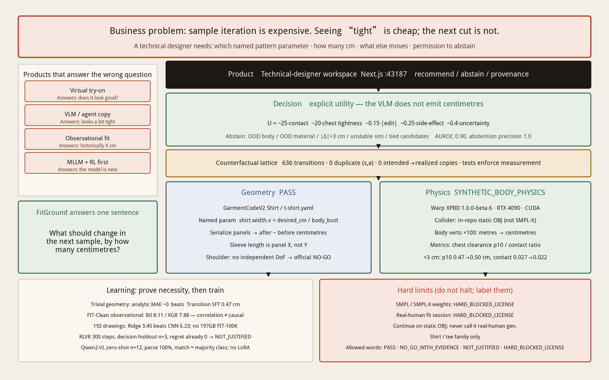
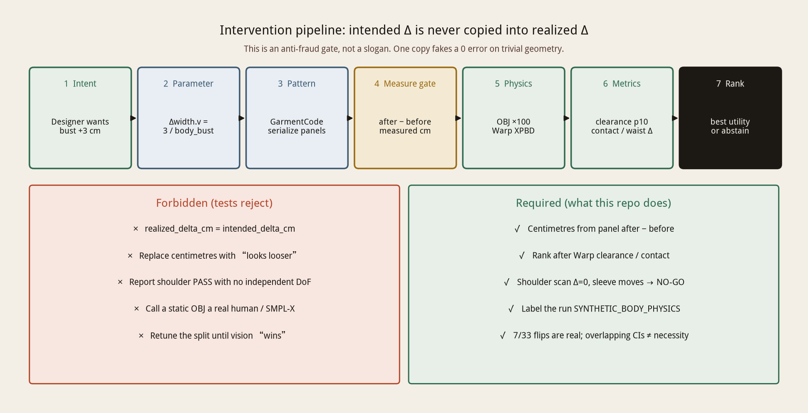
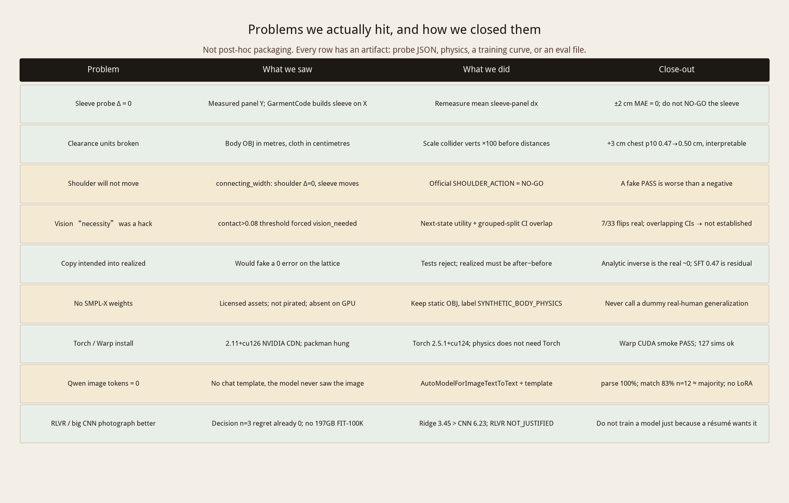
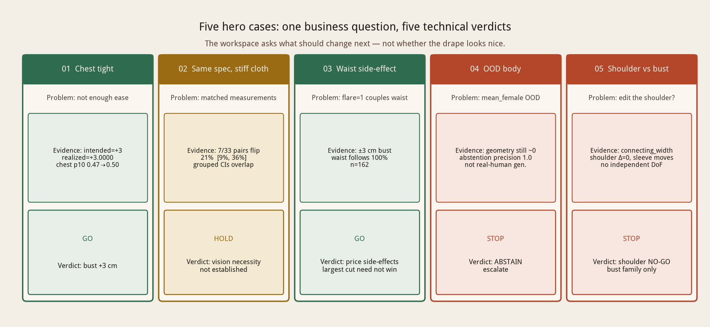

<p align="right">
  <a href="./README.md">中文</a> · <b>English</b>
</p>

# FitGround

**The sample is wrong. Which pattern parameter should change in the next one, by how many centimetres, and what else will move?**

FitGround is not a dressing-room virtual try-on and not a chatbot. It is a **next-sample correction engine for technical designers**. When evidence is thin it abstains instead of inventing a centimetre.

[](https://github.com/Benjamindaoson/FitGround)
[](https://huggingface.co/datasets/jlai300/FitGround)

| Current sample (static-mannequin drape) | After the bust pattern parameter +3 cm |
| --- | --- |
|  |  |

Warp physics on an in-repo static dummy. **Not** a product try-on shot.

---

## 1. Business problem: seeing “tight” is cheap; the next cut is not

In apparel development, one sample loop burns fabric, sewing, and calendar time. A fitter can say “tight across the chest” in seconds. The expensive work is the four questions a technical designer must answer immediately:

1. **Where is the cause** — ease, a locked shoulder, sleeve length, or cloth that is too stiff?  
2. **Which named pattern parameter** — not “look a bit looser”, but `shirt.width.v` or something else.  
3. **How many centimetres** — +1, +2, or +3? Will the waist or sleeve come with it?  
4. **May the system refuse** — if the body, cloth, or action leaves the support set, the problem must go back to a human, not a made-up number.

One wrong cut means another sample. This is not “generate a dressed image.” It is a **counterfactual decision**:

> If I take this cut now, how much will measured geometry move, how will cloth–body change, and is the next sample worth cutting?

Existing products answer a different question:

| Common product | Question it actually answers | Why it cannot run sampling |
| --- | --- | --- |
| Virtual try-on / VTO | Does this look good on a body? | No pattern parameter, no centimetre |
| VLM / agent copy | “Looks a bit tight” | No intervention, no measured Δ, no physics |
| Observational regression | Historically, similar garments differed by X cm | Correlation is not “if I edit this cut” |
| Fine-tune MLLM + RL first | The model is new | On trivial geometry the analytic map is already 0 error |

**That pins the product:** a next-sample recommendation (or an explicit refusal) for a technical designer. Not chat. Not a dressing room.

---

## 2. Technical loop: executable pattern + measurable physics + explicit decision — not an end-to-end model

Read the system first, then why each layer was chosen.



### How the loop turns

```text
Intent (3 cm more chest ease)
  → named pattern parameter (GarmentCode Shirt: shirt.width.v)
  → serialize panels, measure after − before (never copy intended)
  → Warp XPBD on a static mannequin (body OBJ metres → cm)
  → clearance / contact / waist side-effect
  → utility ranking; abstain outside the support set
  → Next.js workspace for the technical designer
```



### Concrete technology, and the decision at the time

| Layer | What we used | Why this, not the photogenic alternative |
| --- | --- | --- |
| Pattern | GarmentCodeV2 `Shirt` / `t-shirt.yaml`, named `shirt.width.v = desired_bust_cm / body_bust` | Centimetres must come from an executable pattern. A CNN “bust” has no next cut |
| Geometry | Panel after − before; tests reject `realized = intended` | One copy fakes a 0 error on trivial geometry and poisons every learner after it |
| Body collider | In-repo static OBJ (`mean_all` / female / male), verts ×100 | SMPL-X weights are license-blocked. Do not halt; label `SYNTHETIC_BODY_PHYSICS` |
| Cloth physics | Warp XPBD 1.0.0-beta.6, RTX 4090 CUDA | We need clearance / contact, not a render score. Physics does not depend on PyTorch |
| Decision | Explicit `U = −25·contact −20·tightness −0.15·\|Δ\| −0.25·side −0.4·uncertainty` | The VLM does not emit centimetres. Waist coupling must be priced |
| Abstain | Support = `mean_all` + default cloth + \|Δ\|≤3 cm + stable sim | OOD body / material / action / ambiguity → ABSTAIN. AUROC 0.90, abstention precision 1.0 |
| Learning | Analytic inverse as iron baseline; SFT / CNN / RLVR only measure residual | Prove necessity before training. Analytic already wins on trivial geometry |
| Product | Next.js workspace `:43187`, 中文 / English toggle | Ranked candidates and provenance for a designer, not a conversation |

Four layers must not collapse into “GarmentCode physics PASS”:

| Layer | Status | Meaning |
| --- | --- | --- |
| Parametric garment geometry | **PASS** | Panels serialize; centimetres are measured |
| `SYNTHETIC_BODY_PHYSICS` | **PASS** | Warp vs in-repo OBJ, metres→cm |
| SMPL-X body physics | **HARD_BLOCKED_LICENSE** | Weights absent; not pirated |
| Real-human validation | **HARD_BLOCKED_LICENSE** | Needs licensed, consented capture |

---

## 3. Problems we hit in the experiment, and how we closed them

Training and simulation were not a straight line. Every row below has an artifact.



**Geometry: sleeve delta was once identically 0.** The first probe measured sleeve length along panel **Y**. GarmentCode constructs sleeve length along **X**. After switching to mean sleeve-panel dx, ±2 cm MAE = 0. That is a measurement-definition bug, not a broken pattern — so sleeve is PASS, not NO-GO.

**Physics: clearance was once unreadable.** Body OBJ is **metres**; cloth mesh is **centimetres**. Distances had no dimensional meaning until collider verts ×100. Then, on the same Shirt, +3 cm moved chest clearance p10 **0.47 → 0.50 cm** and contact **0.027 → 0.022**. Millimetre-class dummy physics, but “does a pattern edit have a physical consequence?” now has an answer.

**Shoulder: the scan can only publish a NO-GO.** `sleeve.connecting_width` from 0.05 to 0.9: shoulder proxy Δ = **0 cm**, sleeve length moves ~3.4 cm. This Shirt family has no independent shoulder DoF. Official: `SHOULDER_ACTION = NO_GO_FOR_CURRENT_PATTERN_FAMILY`. A fake PASS is worse than a negative.

**Vision necessity: a threshold almost faked the story.** A `contact > 0.08` rule once labelled `vision_needed`. We threw it out: next-state utility for whether the best correction flips, grouped-split CIs for whether vision actually helps. Result: **7 of 33 pairs flip (21%, CI about 9%–36%) is real**; measurement-only 0.90 [0.70, 1.00] vs drape 1.00 **CIs overlap**. Verdict: `VISION_NECESSITY_NOT_ESTABLISHED`, not “vision wins.”

**Learning: residual was measured, then we stopped.** Analytic inverse MAE ~0; Transition SFT 0.47 cm, worse. On 192 pattern drawings Ridge 3.45 beats CNN 6.23. Decision holdout n=3 already has regret 0; RLVR ran 300 CUDA steps and is `NOT_JUSTIFIED`. Qwen2-VL without a chat template produced 0 image tokens; with the template, parse 100%, but n=12 match rate is majority-class — **no LoRA**.

**Engineering: licenses and installs must not halt the pipeline.** No SMPL-X on disk → label and continue. Torch 2.11+cu126 stuck on NVIDIA CDN → fall back to 2.5.1+cu124; physics does not need Torch. Warp CUDA smoke PASS, 127 sims ok.

---

## 4. What the evidence actually says (six conclusions)

### 4.1 ±3 cm pattern edits calibrate to numerical noise

`shirt.width.v = desired_cm / body_bust`. On a −3…+3 cm grid, measured `realized_delta_cm` matches intended to ~`1e-14` cm; three +3 cm repeats are exact. With `flare=1`, a bust edit **always** moves the waist — a structural side effect the utility must price.


### 4.2 The cut changes measurable clearance / contact on the dummy

| Version | Chest clearance p10 | Contact ratio |
| --- | --- | --- |
| Current | 0.47 cm | 0.027 |
| +1 cm | 0.48 cm | 0.029 |
| +2 cm | 0.48 cm | 0.027 |
| +3 cm | 0.50 cm | 0.022 |


| Current | +1 | +2 | +3 |
| --- | --- | --- | --- |
|  |  |  |  |

Same spec, different bending (feedstock for the vision experiment):

| Tight default | Tight stiff | Roomy default | Roomy stiff |
| --- | --- | --- | --- |
|  |  |  |  |

### 4.3 Trivial geometry does not need machine learning

| Method | Test MAE (cm) | What it is actually doing |
| --- | --- | --- |
| Analytic inverse | **~0** | `Δwidth = Δcm / body_bust`, the pattern definition |
| Transition SFT MLP | 0.47 | Residual on an 88-row lattice; loses to analytic |
| Observational B0 / XGB | 8.11 / 7.88 | FIT-Clean 104,999 rows, **not** intervention GT |
| Pattern Ridge / CNN | 3.45 / 6.23 | 192 generated drawings; linear beats small CNN |


### 4.4 In the material-ambiguity regime, vision necessity is not statistically established

33 matched-spec pairs, 7 flip the best correction. Grouped-split CIs overlap → **`VISION_NECESSITY_NOT_ESTABLISHED`**. Qwen2-VL-2B zero-shot: parse 100%, match 83% (n=12, majority class `no_edit`).


### 4.5 Under OOD the system abstains instead of inventing a centimetre

| Split | Result |
| --- | --- |
| IID trivial geometry | analytic MAE ~0 (n=88) |
| Synthetic-body OOD | geometry still ~0 (n=402); **not real-human generalization** |
| Material OOD | measurement-only disagrees with stiff gold 21% [9%, 36%] |
| ±3 cm bust, flare=1 | waist follows 100% (n=162) |

Failure-aware n=633: AUROC **0.90**, abstention precision **1.0**. Hero case 4 is the product: the AI refuses.


### 4.6 The loop exits into a technical-designer workspace

Five hero cases are five verdicts on the same business question: edit, withhold a vision claim, price the side-effect, abstain, NO-GO.




```bash
cd studio && npm install && npm run dev
# http://127.0.0.1:43187  (header toggle: 中文 / English)
```

---

## 5. Is there a better approach?

Yes. We refused several that photograph better.

| Looks stronger | Why not this round | When it becomes justified |
| --- | --- | --- |
| Fine-tune Qwen2-VL / GPT-4V first | Analytic inverse is already 0 error on trivial geometry | Matched measurements flip the best correction **and** grouped CIs separate |
| An agent that edits patterns | No measured Δ, no physics | Measurement gate and utility first, language later |
| RLVR pattern editing | Holdout n=3, regret already 0 | Residual the analytic map cannot kill, in the complex regime |
| CNN on FIT-100K | 197GB not downloaded; Ridge already beats CNN on 192 drawings | Licensed images **and** the linear baseline loses |
| Halt without SMPL-X | Wrong. Continue on dummies and label them | Licensed weights arrive; repeat the same lattice |
| Force a shoulder PASS on Shirt | No independent DoF | Calibrate a family that actually has a shoulder parameter |
| Tune the split until vision “wins” | 7/33 flips are real; statistical necessity is not | Never |

**Better next steps after licensed assets** are still not a new model name: repeat the lattice on SMPL-X; keep the analytic inverse as the iron baseline; validate on real fit sessions; claim vision/MLLM only when CIs separate.

---

## 6. Remaining figures and data index

The narrative already carries architecture, pipeline, problems, and headline evidence. Everything else stays in the repo so no chart sits outside the story.

<details>
<summary>Observational FIT-Clean distributions (not intervention GT)</summary>

| Body bust | Waist | Hips | Height |
| --- | --- | --- | --- |
|  |  |  |  |

| Garment bust | Length | Sleeve | Ease |
| --- | --- | --- | --- |
|  |  |  |  |

Full-FIT counterparts: `reports/figures/full_fit_hist_*.png`. Shard memory: 

</details>

<details>
<summary>Training curves and other stats</summary>

| Transition MLP | Transition LM | Decision SFT | Observational MAE |
| --- | --- | --- | --- |
|  |  |  |  |

| Calibration curve | Physics before/after | Decision regret |
| --- | --- | --- |
|  |  |  |

</details>

Numbers: [`artifacts/FINAL_METRICS.json`](artifacts/FINAL_METRICS.json) · [`artifacts/FINAL_STATUS.json`](artifacts/FINAL_STATUS.json) · [`artifacts/hero/correction_lattice_v0.2.jsonl`](artifacts/hero/correction_lattice_v0.2.jsonl) · [`artifacts/hero/visual_disambiguation.json`](artifacts/hero/visual_disambiguation.json) · [`artifacts/hero/ood_results.json`](artifacts/hero/ood_results.json) · [`artifacts/hero/failure_aware.json`](artifacts/hero/failure_aware.json) · [`artifacts/training/observational_and_vision_baselines.json`](artifacts/training/observational_and_vision_baselines.json) · [`artifacts/hero/mllm_eval.json`](artifacts/hero/mllm_eval.json) · [`artifacts/hero/shoulder_scan.json`](artifacts/hero/shoulder_scan.json)

Reports: [`reports/WHEN_IS_LEARNING_NECESSARY.md`](reports/WHEN_IS_LEARNING_NECESSARY.md) · [`reports/TRAINING_RUN.md`](reports/TRAINING_RUN.md) · [`reports/BUST_ATOMIC_CALIBRATION.md`](reports/BUST_ATOMIC_CALIBRATION.md) · [`reports/FAILURE_ANALYSIS.md`](reports/FAILURE_ANALYSIS.md) · [`reports/TECHNICAL_ARCHITECTURE.md`](reports/TECHNICAL_ARCHITECTURE.md)

What died with the GPU host: [`artifacts/GPU_SHUTDOWN_ASSET_INVENTORY.md`](artifacts/GPU_SHUTDOWN_ASSET_INVENTORY.md). **Conclusions live in JSON.**

---

## Status · run · limits

Allowed words only: `PASS` · `NO_GO_WITH_EVIDENCE` · `NOT_JUSTIFIED` · `HARD_BLOCKED_LICENSE`

636 transitions, 127 SIMULATED physics rows. Shoulder NO-GO. RLVR `NOT_JUSTIFIED`. SMPL-X / real human `HARD_BLOCKED_LICENSE`. Full table: [`reports/EXPERIMENT_TABLE.md`](reports/EXPERIMENT_TABLE.md)

```bash
make smoke
make benchmark-fast
cd studio && npm install && npm run dev   # :43187
python3 scripts/draw_story_figures.py     # rebuild architecture / pipeline / hero / problems
```

GPU (GarmentCodeV2 + Warp + RTX; this box does not have the billed-and-powered-off 4090):

```bash
source scripts/gpu/flux_env.sh
python scripts/gpu/hero_pipeline.py
python scripts/gpu/expand_visual_physics.py
python scripts/gpu/finalize_closure.py
```

Hard limits: no SMPL-X, no real-human validation, Shirt/tee only, millimetre-class dummy clearance, Qwen n=12, tiny Decision/RLVR holdout.

Mirrors: [GitHub](https://github.com/Benjamindaoson/FitGround) · [Hugging Face](https://huggingface.co/datasets/jlai300/FitGround)

<p align="right">
  <a href="./README.md">中文</a> · <b>English</b>
</p>
